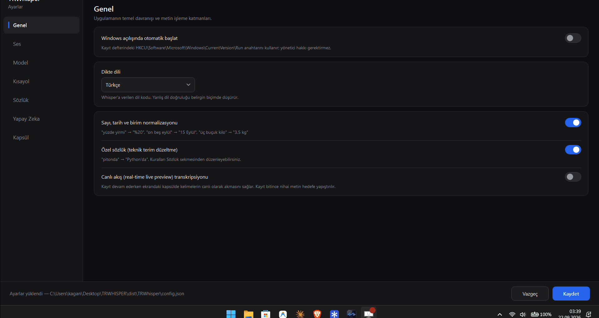

# TRWhisper: Local Push-to-Talk Dictation App for Windows 11 🎙️

[🇬🇧 English](README.md) | [🇹🇷 Türkçe](READMETR.md)

[](https://github.com/kagangungor/TRWhisper/releases/latest)
[](https://github.com/kagangungor/TRWhisper/releases/latest)
[](https://github.com/kagangungor/TRWhisper)
[](LICENSE)
[](https://dotnet.microsoft.com/download/dotnet/9.0)

**TRWhisper** is a completely local, zero-telemetry "push-to-talk" dictation application built for Windows 11 as an alternative to Superwhisper. It is tuned for Turkish dictation.

<p align="center">
  
</p>

---

## 🚀 Key Features

- **Modern Graphical Settings Window (WPF)**: A clean and accessible multi-tab settings panel (**General**, **Audio**, **Model**, **Hotkey**, **Dictionary**, **AI / LLM**, **Overlay Pill**, and **Backup**) to configure and test everything in real time.
- **Custom Dictionary & Jargon Support**: User-defined phonetic/jargon replacements (`dictionary.json`). Automatically corrects technical terms, acronyms, brand names, or words frequently misheard by Whisper with word-boundary awareness and preserves Turkish inflection suffixes (e.g. `pitonda` -> `Python'da`).
- **Advanced Turkish Text Normalization**:
  - Comprehensive rule-based normalization for spoken Turkish numbers, percentages, currency, dates, times, and measurement units (e.g. `yüzde yirmi` -> `%20`, `on beş eylül` -> `15 Eylül`, `üç buçuk kilo` -> `3,5 kg`, `iki buçukta` -> `02:30'da`, `yüz dolar` -> `100 USD`).
  - Strict Turkish vowel and consonant harmony rules when attaching suffixes to numbers and symbols.
- **Context-Aware LLM Modes & Active Window Detection**:
  - Multiple built-in personas & modes: **Clean** (✨ removes fillers like `ııı`, `eee`, `şey`, fixes punctuation/grammar, faithful to original meaning), **Business Email** (📧 turns draft speech into professional correspondence), **Bulleted Summary** (📝 extracts key takeaways and action items into `- ` bullet points), **Code & Technical** (💻 preserves technical terms, formats Markdown code blocks and commands), and **English Translation** (🌐 translates Turkish speech into natural, professional English).
  - Support for user-defined **Custom LLM Modes** and raw transcript fallback.
  - Active foreground window auto-detection (`ForegroundAppDetector`): Intelligently detects active applications (e.g. VS Code, Visual Studio, Outlook, Thunderbird, Windows Terminal) and automatically activates the matching persona, displaying an active app badge on the overlay pill.
  - **Hardware-Backed Secure API Key Storage**: Encrypted with Windows DPAPI (`Data Protection API`) using application-specific entropy (`TRWhisper_DPAPI_Entropy_v2`); keys are never stored in plain text or transmitted over unencrypted HTTP.
- **Flexible Hotkeys & 3 Dictation Modes**:
  - Classic **Push-to-Talk** mode (default: Right Ctrl — press & hold, release to transcribe).
  - **Toggle** mode (press once to start recording, press again to stop).
  - **Hands-Free** mode with intelligent silence detection to automatically finish dictation when you stop speaking (configurable silence threshold & duration).
  - Fully customizable hotkeys and modifier keys (Right/Left Ctrl, Shift, Alt, CapsLock, Function keys F8/F9, Mouse4/Mouse5, and custom combinations).
- **Real-Time Live Streaming Preview**:
  - Real-time live preview (`EnableStreamingPreview`): Words stream dynamically into the floating pill overlay while you speak, followed by the final refined transcription when you finish.
- **In-Process Whisper.net Engine & Model Management**:
  - High-performance in-process native Whisper.net C# engine alongside Whisper CLI.
  - Download, switch, and delete models directly inside the Settings UI with real-time speed tracking and cryptographic **SHA-256 validation**.
  - Automatic idle memory unloading (`IdleTimeoutMinutes`) to free VRAM/RAM when not dictating.
- **Auto-Paste & Dual Clipboard Modes**:
  - **Clipboard** mode: Copies transcript to clipboard and simulates `Ctrl + V` via Win32 `SendInput`, with optional `RestoreClipboard` to automatically restore your previous clipboard content after pasting.
  - **DirectType** mode: Types text character-by-character via `KEYEVENTF_UNICODE` without modifying the clipboard.
- **100% Offline & Private (STT) + Strict Privacy Controls**:
  - Powered by local Whisper. Your voice data never leaves your computer.
  - **Privacy-First Logging**: Optional transcript logging (`EnableHistoryLogging`) allows disabling markdown logs completely. Diagnostic logs (`trwhisper.log`) sanitize transcript content (recording only character counts and performance metrics). Temporary audio recordings use session-scoped GUIDs (`trwhisper_{Guid}.wav`) and are purged immediately.
- **NVIDIA GPU Acceleration (CUDA 13)**: Built with **CUDA 13** acceleration for modern NVIDIA GPUs (requires NVIDIA driver >= 580.00). Large-v3 Turbo processes dictations in ~2–3 seconds instead of ~23 seconds on CPU. Automatically falls back to CPU if no compatible GPU or driver is detected.
- **Silence Detection & Hallucination Filter**:
  - Built-in **Silero VAD** skips non-speech segments to avoid phantom text on silent triggers.
  - Filters out known Whisper phantom subtitles (`Altyazı M.K.`, `İzlediğiniz için teşekkür ederim.`) and audio bracket tags (`[MÜZİK ÇALIYOR]`).
- **Floating Pill Overlay**: Real-time animated audio waveform, live streaming text, processing indicator, active app/mode badge, low-microphone audio warning, raw/cleaned transcript switch, and cancel (✕) / complete (✓) / copy buttons with custom positioning.
- **Windows Startup Integration**: Enable or disable autostart on Windows boot with a single switch in the Settings UI (HKCU Run key, no admin rights required).
- **Backup & Restore**: Dictation logs (`.md`), the custom dictionary and your settings are packed into a single ZIP. Back up with one click from the tray menu or Settings, and restore from any archive. Includes automatic backups at startup, a retention limit, and a safety backup taken right before every restore. The API key is never written into a backup.
- **Daily API Call Cap (Cost Control)**: With a cloud provider selected, a daily request cap is enforced (default 200). When the cap is reached, LLM cleanup is either skipped (**Block**) or merely warned about while the call proceeds (**Warn only**) — your choice. A heads-up warning fires at 80% of the cap.
- **API Key Lifecycle**: The app records when the key was last changed and reminds you to rotate it once a threshold (default 90 days) is crossed. One-click key deletion and a direct link to the provider's key console.
- **Automated Test Suite**: 152 automated unit tests and a UI smoke testing utility (`uismoke`) guaranteeing zero XAML template breakage.
- **Local Markdown Logging**: Transcripts can be logged with timestamps to `%USERPROFILE%\Dictation\YYYY-MM.md`. Operational logs are written to `%USERPROFILE%\Dictation\trwhisper.log`.

---

## 🛠️ Installation & Requirements

**Requirements**
- Windows 11 x64
- [.NET 9 SDK](https://dotnet.microsoft.com/download/dotnet/9.0) (to build from source)
- Optional: an NVIDIA GPU with a compatible driver (NVIDIA driver >= 580.00 for CUDA 13 support) for GPU acceleration

### ⚡ Easy Installation (Recommended): Single-File Setup Wizard

Download the latest **[release](https://github.com/kagangungor/TRWhisper/releases/latest)**
(`TRWhisper-Setup-x.y.z.exe`, ~51 MB) and run it. No administrator password is required;
the app is installed into `%LOCALAPPDATA%\Programs\TRWhisper`.

The wizard is available in Turkish and English and states exactly what will be installed
before it starts:

| Component | Status |
|---|---|
| TRWhisper application (.NET 9 embedded, no separate .NET needed) | Always (inside the setup file) |
| Silero VAD silence model | Always (inside the setup file) |
| Whisper **CPU** engine | Inside the setup file — works on every PC |
| Whisper **NVIDIA GPU (CUDA 13)** engine | Optional, ~519 MB download (~680 MB uncompressed; auto-recommended if an NVIDIA GPU with driver >= 580.00 is found) |
| **Large-v3 Turbo** model (~547 MB) | Optional (Recommended: highest Turkish accuracy, fast on GPU) |
| **Small** model (~465 MB) | Optional (Balanced & fast: ideal for CPU-only systems) |
| **Base** model (~148 MB) | Optional (Very fast, lightweight: for quick notes) |
| **Tiny** model (~75 MB) | Optional (Ultra-lightweight: lowest resource usage) |
| **Medium** model (~1.5 GB) | Optional (High accuracy: standard full model) |
| **Large-v3** model (~3.1 GB) | Optional (Maximum accuracy: requires powerful GPU) |
| Microsoft Visual C++ 2015-2022 Runtime | Only downloaded and installed if missing (one UAC prompt) |
| Desktop / Start menu shortcut, start with Windows | Optional |

- You can download, delete, and manage any of these models directly within the **⚙️ Settings > Model** tab with real-time progress, switching between installed models from the tray at any time with zero downtime.
- Every download is verified with **SHA-256**, and files that are already installed are not
  downloaded again (re-run the setup to change your engine/model choice).
- Uninstall: **Settings > Apps > TRWhisper**. You are asked whether your dictation records
  (`%USERPROFILE%\Dictation`) should be deleted as well.
- Silent installation (for deployment):
  ```powershell
  TRWhisper-Setup-2.1.0.exe /SILENT /ENGINE=cuda /MODELS=turbo,small /TASKS=desktopicon
  ```

> [!NOTE]
> **Security & VirusTotal Results (68/69 Clean):**  
> Because this is a free, independent open-source project without an expensive commercial EV code signing certificate, Windows SmartScreen may show an "unknown publisher" warning on first launch: **More info > Run anyway**.  
>  
> You can review the updated [VirusTotal Scan Report (v2.1.0)](https://www.virustotal.com/gui/file/bc7f92be96bae06c652c572e3da75953c105eba5755d22505e5ad2532d98d3ff?nocache=1). Top-tier security vendors including Microsoft Defender, Kaspersky, Bitdefender, ESET, Sophos, and Malwarebytes (**68 vendors in total**) confirm the binary is **100% clean**.  
>  
> **Regarding the 1 Heuristic/ML Detection (Trapmine):**  
> This automated machine-learning endpoint engine assigns a generic low-confidence suspicion score (`Suspicious.low.ml.score`) to newly observed unsigned binaries. TRWhisper's implementation of low-level Windows APIs — global low-level keyboard hooks (`SetWindowsHookEx` / `WH_KEYBOARD_LL`) for push-to-talk hotkeys, keyboard event synthesis (`SendInput`) to paste recognized text directly into active fields, and Windows DPAPI for encrypting local user credentials — naturally triggers aggressive heuristic engines. The entire codebase is open source, transparent, and completely safe.

---

### 🔧 Installing from Source (for developers)

The steps below are only needed if you want to build the project from source.

### 1. Windows Microphone Permissions
Ensure microphone access is enabled in Windows 11:
1. **Settings (Win + I)** > **Privacy & security** > **Microphone**.
2. Toggle **"Microphone access"** to **On**.
3. Ensure **"Let desktop apps access your microphone"** is set to **On**.

### 2. Whisper Engine and Model Setup (Automatic)
Run the setup script with PowerShell from the project root directory:

```powershell
# CPU build + Large-v3 Turbo model + VAD model
powershell -ExecutionPolicy Bypass -File scripts\setup.ps1

# NVIDIA GPU (CUDA 13) build instead — recommended if you have an NVIDIA GPU
powershell -ExecutionPolicy Bypass -File scripts\setup.ps1 -Cuda

# Optionally download other models (small, base, tiny, medium, large-v3):
powershell -ExecutionPolicy Bypass -File scripts\setup.ps1 -Model small
powershell -ExecutionPolicy Bypass -File scripts\setup.ps1 -Model base
```

The script:
- Creates the `tools\whisper\` and `%USERPROFILE%\Dictation\` folders.
- Downloads the tested `whisper.cpp` **v1.9.3** (build `b4938`) Windows x64 binaries (CPU build ~8 MB or CUDA build) and, with `-Cuda`, downloads the CUDA 13 runtime DLLs (`cudart64_13.dll`, `cublas64_13.dll`, `cublasLt64_13.dll`, ~385 MB) required by the in-process Whisper.net engine. Running it again with `-Cuda` upgrades an existing CPU installation.
- Downloads the selected model (default `large-v3-turbo-q5_0`) and the Silero VAD model.
- Skips anything that already exists.

| File | Size | Purpose |
|---|---|---|
| `ggml-large-v3-turbo-q5_0.bin` | ~547 MB | Default model, highest Turkish accuracy (GPU recommended) |
| `ggml-small.bin` | ~465 MB | Fast and balanced on CPU |
| `ggml-base.bin` | ~148 MB | Very fast, lightweight, low resource consumption |
| `ggml-tiny.bin` | ~75 MB | Ultra-lightweight, minimal memory footprint |
| `ggml-medium.bin` | ~1.5 GB | High-accuracy standard model |
| `ggml-large-v3.bin` | ~3.1 GB | Full-sized maximum accuracy model (requires powerful GPU) |
| `ggml-silero-v6.2.0.bin` | ~1 MB | Voice activity detection (silence filter) |

> **Manual Download Alternative:**
> - Whisper binaries ([release b4938](https://github.com/ggml-org/whisper.cpp/releases/tag/b4938)): extract Windows binaries into `tools\whisper\`. For CUDA GPU acceleration, ensure CUDA 13 runtime DLLs (`cudart64_13.dll`, `cublas64_13.dll`, `cublasLt64_13.dll`) are placed in `tools\cuda13\` (or alongside the application executable).
> - Models: [ggml-large-v3-turbo-q5_0.bin](https://huggingface.co/ggerganov/whisper.cpp/resolve/main/ggml-large-v3-turbo-q5_0.bin), [ggml-small.bin](https://huggingface.co/ggerganov/whisper.cpp/resolve/main/ggml-small.bin), [ggml-base.bin](https://huggingface.co/ggerganov/whisper.cpp/resolve/main/ggml-base.bin), [ggml-tiny.bin](https://huggingface.co/ggerganov/whisper.cpp/resolve/main/ggml-tiny.bin), [ggml-medium.bin](https://huggingface.co/ggerganov/whisper.cpp/resolve/main/ggml-medium.bin), [ggml-large-v3.bin](https://huggingface.co/ggerganov/whisper.cpp/resolve/main/ggml-large-v3.bin) and [ggml-silero-v6.2.0.bin](https://huggingface.co/ggml-org/whisper-vad/resolve/main/ggml-silero-v6.2.0.bin) → save them into `tools\whisper\`.

### 3. Bypassing Windows SmartScreen and Defender Warnings
Because TRWhisper uses a low-level keyboard hook (`WH_KEYBOARD_LL`) and the `SendInput` API, Windows Defender or SmartScreen may display a warning on first launch:
1. **If the SmartScreen prompt appears:** Click **"More info"** and select **"Run anyway"**.
2. **Adding a Windows Defender Exclusion (Optional):**
   ```powershell
   # Open PowerShell as Administrator in the project directory and run:
   Add-MpPreference -ExclusionPath (Get-Location).Path
   # Or specify the full path: Add-MpPreference -ExclusionPath "C:\YourFolderPath\TRWHISPER"
   ```

---

## 🔐 Security & Privacy

### How your API key is protected (threat model)
- The API key you enter for cloud LLM cleanup is **never written in plain text** to `config.json`: it is encrypted with Windows DPAPI (`DataProtectionScope.CurrentUser`) and stored with an `enc:` prefix. If DPAPI encryption fails, the key is **not written to disk at all**.
- This protection is **bound to your Windows account**: the file cannot be decrypted on another account, another machine, or from an offline disk backup.
- **What it does not protect against:** malware running as the same Windows user can call the same DPAPI API and decrypt the key. This is an inherent limit of local secret storage (including Windows Credential Manager). For maximum privacy, run LLM cleanup fully locally with **Ollama** — no API key is needed at all.
- The app **refuses** to send an API key to any non-loopback `http://` endpoint — regardless of provider (Gemini, OpenAI or Ollama); HTTPS is mandatory for external endpoints.

### Key scope, lifetime and rotation
TRWhisper has no session or token lifecycle of its own: authentication is a single static API key, and **its scope, lifetime and revocation can only be controlled from the provider's console**. Rather than hiding that fact, the app surfaces it:

- The moment the key was last changed (`LlmCleaning.ApiKeyUpdatedUtc`) is recorded. **Settings → AI** shows the key's age and raises a rotation warning once the `ApiKeyRotationReminderDays` threshold (default **90 days**) is crossed. The stamp is refreshed only when the key actually changes, not on every save.
- The **"Delete key"** button removes the key from this machine immediately and saves settings. Deleting does not invalidate it — revoke it in the provider console as well.
- The **"Open key console"** button takes you to the right page: [Google AI Studio](https://aistudio.google.com/app/apikey) or [OpenAI API keys](https://platform.openai.com/api-keys).
- Recommended in the provider console: restrict the key to the model/API you actually use, add an IP restriction where possible, set budget and quota alerts, and delete unused keys.
- The strongest answer is to have no key at all: run LLM cleanup locally with **Ollama**.

### Cost and quota control
With a cloud provider selected, every LLM-cleaned dictation is one API call. A budget alert in the provider console only tells you **after** the money is spent, so the cap lives inside the app:

- `LlmCleaning.DailyRequestLimit` (default **200**, `0` = unlimited) caps cloud calls per calendar day. The counter lives in `api-usage.json` next to `config.json` and resets at local midnight.
- `LlmCleaning.QuotaExceededAction` decides what happens when the cap is hit:
  - `Block` (default) — the request is **never sent**, the raw transcript is pasted, and a tray warning appears. No extra cost.
  - `WarnOnly` — the request is still sent and only a warning is shown. Your bill can keep growing.
- A heads-up warning fires at **80%** of the cap. An invalid or unknown `QuotaExceededAction` value silently falls back to `Block`.
- Local providers (Ollama, LlamaCpp) are never counted — they cost nothing.
- The live counter is shown under **Settings → AI → Usage and Cost Cap** and can be reset there (this does not change actual usage at the provider).

### Logs and dictation content
- The diagnostic log (`%USERPROFILE%\Dictation\trwhisper.log`) **contains no transcript text**, only character counts. Provider error bodies are capped at 200 characters and key-like strings are masked.
- Plain-text transcript lines left over from builds older than 2.0.1 are purged automatically, once, at startup.
- Transcript history (`%USERPROFILE%\Dictation\YYYY-MM.md`) can be disabled entirely with `EnableHistoryLogging: false`.
- Temporary audio files are created under `%TEMP%` with unique GUID names and deleted as soon as transcription finishes; orphans are cleaned up at startup.

### Backup and restore
Your dictation history and custom dictionary cannot be regenerated. TRWhisper packs them into a single ZIP:

| Backup contents | Source |
| :--- | :--- |
| `config.json` | Settings — **with the API key stripped out** |
| `dictionary.json` | Custom dictionary rules |
| `transkriptler/*.md` | Monthly dictation logs from `%USERPROFILE%\Dictation` |
| `YEDEK-BILGI.TXT` | Date, machine name and restore instructions |

- **Creating a backup:** tray menu **"💾 Back up now"**, or **Settings → Backup → "Back up now"**.
- **Automatic backups:** when `Backup.EnableAutomaticBackup` is on and `AutomaticBackupIntervalDays` (default 1) have passed since the last one, TRWhisper takes a backup silently in the background at startup. `RetentionCount` (default 10) decides how many of the newest archives are kept; the rest are deleted.
- **Restoring:** **Settings → Backup → "Restore from backup"**. Settings, the dictionary and same-named log files are **overwritten**, so a **safety backup** of the current state is taken immediately beforehand and its name is reported in the status line.
- **The API key is never written into a backup.** Two reasons: a backup is an ordinary, portable file and must not carry secrets; and the key is DPAPI-encrypted against this Windows account, so it could not be decrypted on another machine anyway. After a restore your current key is preserved — the empty value from the archive does not overwrite it.
- When extracting, only plain `.md` names are accepted; entries containing path separators, `..` or any other extension are ignored (zip-slip protection).
- Backups stay local. To copy them to another drive or to cloud-synced storage, point `Backup.BackupDirectory` at that location (e.g. `D:\Backups\TRWhisper`).

### Download integrity
- `scripts\setup.ps1`, the setup wizard and the in-app model downloader **verify every downloaded file against a pinned SHA-256 digest** — whisper.cpp binaries, GGML models, the Silero VAD model and CUDA runtime packages included. On a mismatch the file is deleted and the operation stops (fail-closed).
- Hugging Face URLs are pinned to a specific commit, so a change on `main` cannot alter what you download.

### Installation, signing and verification
- Released installers are currently **not Authenticode signed** (this is the main reason for the SmartScreen prompt). Verify your download against the digest published in the release notes:
  ```powershell
  Get-FileHash .\TRWhisper-Setup-2.1.0.exe -Algorithm SHA256
  ```
  The build script supports signing: `scripts\build-installer.ps1 -CertThumbprint <certificate_thumbprint>` (or the `TRWHISPER_SIGN_THUMBPRINT` environment variable).
- The default installation requires no administrator rights and goes to `%LOCALAPPDATA%\Programs\TRWhisper`. Because that directory is writable by the same user, hardened environments can install into **Program Files** instead:
  ```powershell
  .\TRWhisper-Setup-2.1.0.exe /ALLUSERS
  ```
  In that mode the application directory stays read-only; settings go to `%APPDATA%\TRWhisper` and downloaded models to `%LOCALAPPDATA%\TRWhisper`.
- At startup the app restricts DLL search to its own directory and `System32` (`SetDefaultDllDirectories`), narrowing the DLL hijacking / binary planting surface.

---

## ⚙️ Configuration (`config.json`)

You can configure every setting easily through the graphical interface by right-clicking the tray icon and selecting **"⚙️ Ayarlar"** (Settings). Alternatively, you can edit `config.json` in the application directory:

```json
{
  "General": {
    "Language": "tr",
    "LogDirectory": "%USERPROFILE%\\Dictation",
    "TempAudioPath": "%TEMP%\\trwhisper_temp.wav",
    "EnableCustomDictionary": true,
    "EnableTextNormalization": true,
    "EnableStreamingPreview": true,
    "EnableHistoryLogging": true
  },
  "Whisper": {
    "CliPath": "tools\\whisper\\whisper-cli.exe",
    "ModelPath": "tools\\whisper\\ggml-large-v3-turbo-q5_0.bin",
    "VadModelPath": "tools\\whisper\\ggml-silero-v6.2.0.bin",
    "Threads": 4,
    "NoTimestamps": true,
    "TimeoutSeconds": 120,
    "IdleTimeoutMinutes": 10
  },
  "LlmCleaning": {
    "EnabledByDefault": false,
    "Provider": "Ollama",
    "ApiKey": "",
    "Model": "qwen2.5:3b",
    "Endpoint": "http://localhost:11434/v1/chat/completions",
    "ActiveModeId": "Clean",
    "EnableAutoAppMode": true,
    "ApiKeyRotationReminderDays": 90,
    "DailyRequestLimit": 200,
    "QuotaExceededAction": "Block",
    "SystemPrompt": "Aşağıdaki metin Türkçe sesli dikte (speech-to-text) çıktısıdır. Lütfen bu metni konuşma dilinden temiz yazı diline dönüştür:\n1. 'ııı', 'eee', 'şey', 'yani', 'falan', 'hımm' gibi duraksama ve dolgu kelimelerini temizle.\n2. Noktalama işaretlerini (nokta, virgül, soru işareti vb.) ve büyük/küçük harf kullanımını eksiksiz düzelt.\n3. Anlatılmak istenen ana fikri ve kelime anlamlarını kesinlikle değiştirme.\n4. Çıktı olarak YALNIZCA düzeltilmiş metni ver. Başına ya da sonuna açıklama, tırnak işareti, selamlama veya markdown ekleme."
  },
  "Paste": {
    "PasteMode": "Clipboard",
    "RestoreClipboard": true,
    "RestoreDelayMs": 200
  },
  "Audio": {
    "InputDeviceId": ""
  },
  "Hotkey": {
    "PushToTalkKey": "RightCtrl",
    "LlmModifierKey": "Shift",
    "DictationMode": "PushToTalk",
    "HandsFreeSilenceMs": 1800,
    "HandsFreeSilenceThreshold": 0.012
  },
  "Overlay": {
    "Position": "Bottom",
    "ResultDurationSeconds": 10
  },
  "Backup": {
    "EnableAutomaticBackup": true,
    "AutomaticBackupIntervalDays": 1,
    "RetentionCount": 10,
    "IncludeTranscripts": true,
    "BackupDirectory": "%USERPROFILE%\\Dictation\\Yedekler"
  }
}
```

- **`EnableCustomDictionary`**: Enables user-defined phonetic/jargon mappings in `dictionary.json`.
- **`EnableTextNormalization`**: Enables rule-based spoken numbers, dates, times, currencies, and units normalization.
- **`EnableStreamingPreview`**: Displays words live in the floating overlay pill in real time while speaking.
- **`EnableHistoryLogging`**: Toggles saving transcript records to `%USERPROFILE%\Dictation\YYYY-MM.md` (can be disabled for privacy).
- **`IdleTimeoutMinutes`**: Automatically unloads the model from RAM/VRAM after inactivity (default: 10 minutes; 0 keeps model warm indefinitely).
- **`PasteMode`**: `Clipboard` (copies to clipboard and simulates `Ctrl + V`) or `DirectType` (types character-by-character via `KEYEVENTF_UNICODE` without modifying the clipboard).
- **`RestoreClipboard`**: Automatically restores previous clipboard contents after dictation has been pasted (Clipboard mode only).
- **`DictationMode`**: `PushToTalk` (press & hold), `Toggle` (press once to start, press again to stop), or `HandsFree` (voice toggle with automatic silence cutoff).
- **`HandsFreeSilenceMs`**: Silence duration (ms) before hands-free dictation automatically finishes.
- **`Provider`**: `Ollama`, `Gemini`, or `OpenAI`. Cloud API keys are securely encrypted with Windows DPAPI (`TRWhisper_DPAPI_Entropy_v2`). Gemini transmits keys via the `x-goog-api-key` header, and external endpoints enforce HTTPS.
- **`ActiveModeId`**: Active LLM persona (`Clean`, `Email`, `Summary`, `Technical`, `TranslateEn`, or custom IDs).
- **`EnableAutoAppMode`**: Automatically adapts LLM mode based on the foreground application detected by `ForegroundAppDetector`.
- **`ApiKeyRotationReminderDays`**: Show a rotation reminder in Settings once the API key has gone unchanged for this many days (default 90; `0` disables the reminder).
- **`DailyRequestLimit`**: Maximum cloud calls per day (default 200; `0` = unlimited). Local providers are never counted.
- **`QuotaExceededAction`**: What to do once the cap is hit — `Block` (skip LLM cleanup, incur no extra cost) or `WarnOnly` (warn but still send the request).
- **`Backup.EnableAutomaticBackup` / `AutomaticBackupIntervalDays` / `RetentionCount`**: Automatic backup at startup, the minimum days between backups, and how many archives to keep (`0` = keep all).
- **`Backup.IncludeTranscripts`**: Whether dictation logs (`.md`) are packed into the backup. When off, the archive holds only settings and the dictionary.
- **`Backup.BackupDirectory`**: Folder the backup ZIPs are written to; environment variables such as `%USERPROFILE%` are supported.

> **Tip (Cloud API):** You can obtain a free Gemini API key from Google AI Studio and enter it via the Settings UI. If left empty, LLM cleanup is skipped and raw local transcripts are pasted directly.

### 🦙 100% Local & Private LLM Cleanup (Ollama)

If you prefer to perform LLM cleanup completely offline and private without cloud APIs (Gemini/OpenAI), you can use **Ollama**:

1. Download Ollama from [ollama.com](https://ollama.com) or install via terminal:
   ```powershell
   winget install Ollama.Ollama
   ```
2. Pull a lightweight model with strong Turkish/multilingual text correction capabilities:
   ```powershell
   ollama run qwen2.5:3b
   # or
   ollama run llama3.2:3b
   ```
3. Right-click the TRWhisper tray icon and open **⚙️ Settings > AI (LLM)**:
   - **Provider:** `Ollama`
   - **Endpoint:** `http://localhost:11434`
   - **Model:** `qwen2.5:3b` (or your pulled model name)
   - **API Key:** Leave empty (none required for local inference).

This provides an air-gapped pipeline: STT (Whisper) and text enhancement (Ollama) both run 100% on your local machine with zero data leaving your PC.

---

## ⚡ Performance

Measured on an Intel Core i5-12450H + NVIDIA GeForce RTX 3050 Laptop GPU (4 GB) with Turkish speech samples. Times include model loading, which happens on every dictation.

| Engine | Model | 3.2 s speech | 10.7 s speech |
|---|---|---|---|
| CPU | Small | 6.5 s | 9.3 s |
| CPU | Large-v3 Turbo | 23.1 s | 24.4 s |
| CUDA 13 (RTX 3050) | Small | 2.2 s | 2.8 s |
| CUDA 13 (RTX 3050) | Large-v3 Turbo | 2.5 s | 3.1 s |

- On the GPU, Turbo is both faster and more accurate than Small on the CPU; it uses ~1.2 GB of VRAM.
- The first dictation after the GPU has been idle can take a few seconds longer.
- Without speech, VAD lets the engine skip the heavy work, so an empty recording finishes in ~1–2 seconds.

---

## 🩺 Troubleshooting

- **Something doesn't work as expected:** check `%USERPROFILE%\Dictation\trwhisper.log`.
- **Text is not pasted into an app running as Administrator:** Windows blocks simulated keystrokes from a normal app into elevated windows. The text is still on the clipboard — paste it with `Ctrl + V`.
- **Transcription takes 20+ seconds:** you are probably running Large-v3 Turbo on the CPU. Install the CUDA build with `setup.ps1 -Cuda` (NVIDIA GPU with driver >= 580.00 required) or select **Small** from the tray menu.

---

## 🚀 Building & Running from Source

Using PowerShell:
```powershell
# Run in development mode
powershell -ExecutionPolicy Bypass -File scripts\build.ps1 -Run

# Create a self-contained, single-file Release package (in publish\ folder)
powershell -ExecutionPolicy Bypass -File scripts\build.ps1 -Publish
```

> **Note:** Always create release packages with `build.ps1 -Publish`. This bundles WPF native libraries inside the single-file executable (`IncludeNativeLibrariesForSelfExtract`). A plain `dotnet publish` without these flags produces an executable that crashes on launch. The application locates the `tools\whisper\` folder either beside the executable or in its parent directories.

---

## 🧪 Testing & Verification

TRWhisper maintains high reliability with automated test suites:

```powershell
# Run the 152 automated unit tests (AppMode, Hotkeys, LLM, ModelManager, DPAPI, data paths, etc.):
dotnet test tests\TRWhisper.Tests\TRWhisper.Tests.csproj

# Run the WPF Settings Window XAML template & UI smoke test suite:
dotnet run --project tools\uismoke
```
