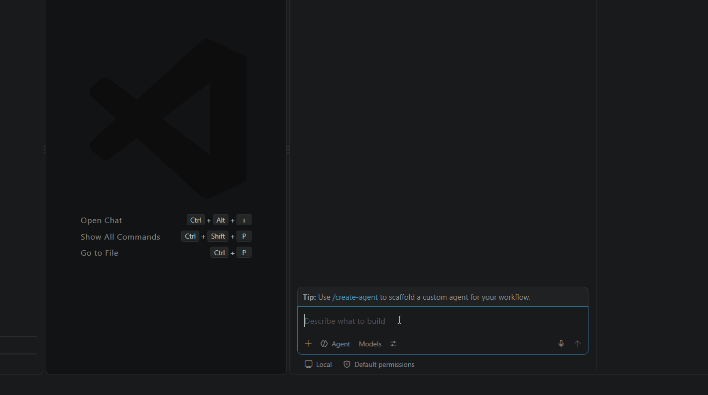

# TRWhisper: Windows 11 Yerel Bas-Konuş Dikte Uygulaması 🎙️

[🇹🇷 Türkçe](READMETR.md) | [🇬🇧 English](README.md)

[](https://github.com/kagangungor/TRWhisper/releases/latest)
[](https://github.com/kagangungor/TRWhisper/releases/latest)
[](https://github.com/kagangungor/TRWhisper)
[](LICENSE)
[](https://dotnet.microsoft.com/download/dotnet/9.0)

**TRWhisper**, Windows 11 için geliştirilmiş, Superwhisper alternatifi, tamamen yerel çalışan, sıfır telemetrili bir "bas-konuş" (push-to-talk) dikte uygulamasıdır. Türkçe dikte için ayarlanmıştır.

<p align="center">
  
</p>

---

## 🚀 Temel Özellikler

- **Global Kısayol Tuşu**: **Sağ Ctrl** tuşunu basılı tutarak konuşun; tuşu bıraktığınızda konuşma yerel olarak metne dönüştürülür.
- **Otomatik Yapıştırma**:
  1. Transkript metnini panoya (clipboard) kopyalar.
  2. Win32 `SendInput` API'si ile `Ctrl + V` tuşlayarak imlecin bulunduğu alana yapıştırır.
  3. Metin panoda kalır; başka bir yere de `Ctrl + V` ile yapıştırabilirsiniz (önceki pano içeriğinin yerini alır; Windows pano geçmişi açıksa `Win + V` ile hâlâ erişilebilir).
- **Tamamen Çevrimdışı ve Gizli (STT)**: Yerel `whisper.cpp` motoruyla çalışır. Sesiniz hiçbir sunucuya gönderilmez.
- **NVIDIA GPU Hızlandırma (isteğe bağlı)**: `whisper.cpp`'nin CUDA derlemesiyle **Large-v3 Turbo** modeli kısa bir dikteyi işlemcideki ~23 saniye yerine ~2–3 saniyede çözer (bkz. [Performans](#-performans)). GPU yoksa otomatik olarak işlemciye geçer.
- **Tepsiden Model Seçimi**: **Small** (işlemcide daha hızlı, daha az doğru) ile **Large-v3 Turbo** (en doğru) arasında istediğiniz an geçiş yapabilirsiniz; yeniden başlatma gerekmez. Dosyası olmayan model menüde soluk görünür; kullanılabilir NVIDIA GPU'su olmayan bir bilgisayarda Turbo seçilirse "yavaş olabilir" uyarısı gösterilir.
- **Sessizlik Algılama ve Uydurma Metin Filtresi**:
  - `whisper.cpp`'nin yerleşik **Silero VAD** özelliği konuşma olmayan kısımları atlar. Kısayola basıp konuşmazsanız hiçbir şey yapıştırılmaz ("Altyazı M.K." gibi hayalet metinler yerine).
  - Whisper'ın bilinen uydurmaları (ör. `Altyazı M.K.`, `İzlediğiniz için teşekkür ederim.`) ve konuşma dışı etiketler (`[MÜZİK ÇALIYOR]`, `(Müzik)`, `[BLANK_AUDIO]`) temizlenir. Bu yalnızca satırın tamamı böyleyse yapılır, gerçek dikte kesilmez.
- **Kayan Durum Hapı (Pill Overlay)**: Kayıt sırasında **Dinleniyor**, işlem sırasında **Çözümleniyor...** gösterir; iptal (✕) ve bitir (✓) düğmeleri vardır. İş bitince transkripti bir **Kopyala** düğmesiyle birlikte gösterir.
- **İsteğe Bağlı LLM Temizleme Modu**: Konuşurken **Sağ Ctrl + Shift** tuşlarını basılı tutarsanız (veya tepsi menüsünden **✨ LLM Temizleme**'yi açarsanız) transkript Gemini veya OpenAI API'sine gönderilir; dolgu kelimeleri (`ııı`, `eee`, `şey`, `yani`) temizlenip noktalama düzeltildikten sonra yapıştırılır.
- **Sistem Tepsisi**:
  - 🔵 **Mavi**: Boşta (hazır)
  - 🔴 **Kırmızı**: Kaydediyor (konuşun)
  - 🟡 **Amber**: Çözümlüyor
  - Sağ tık menüsü: LLM temizleme anahtarı, **🧠 Whisper Modeli**, **son 10 transkript** (tıklayınca kopyalanır), dikte klasörünü açma, ayarları açma ve çıkış.
- **Yerel Günlük**: Her transkript zaman damgasıyla `%USERPROFILE%\Dictation\YYYY-MM.md` dosyasına kaydedilir. Geçici ses dosyası hemen silinir. Tanılama mesajları `%USERPROFILE%\Dictation\trwhisper.log` dosyasına yazılır.

---

## 🛠️ Kurulum ve Gereksinimler

**Gereksinimler**
- Windows 11 x64
- [.NET 9 SDK](https://dotnet.microsoft.com/download/dotnet/9.0) (kaynak koddan derlemek için)
- İsteğe bağlı: GPU hızlandırma için güncel sürücülü (CUDA 12.4 destekli) bir NVIDIA ekran kartı

### ⚡ Kolay Kurulum (Önerilen): Tek Dosyalık Kurulum Sihirbazı

En son sürümü **[Releases](https://github.com/kagangungor/TRWhisper/releases/latest)** sayfasından
indirin (`TRWhisper-Setup-x.y.z.exe`, ~51 MB) ve çalıştırın. Yönetici şifresi gerekmez;
uygulama `%LOCALAPPDATA%\Programs\TRWhisper` klasörüne kurulur.

Sihirbaz Türkçe ve İngilizce'dir ve kuruluma başlamadan önce ne kurulacağını açıkça yazar:

| Bileşen | Durum |
|---|---|
| TRWhisper uygulaması (.NET 9 gömülü, ayrıca .NET gerekmez) | Her zaman (kurulum dosyasının içinde) |
| Silero VAD sessizlik modeli | Her zaman (kurulum dosyasının içinde) |
| Whisper **CPU** motoru | Kurulum dosyasının içinde — her bilgisayarda çalışır |
| Whisper **NVIDIA GPU (CUDA 12.4)** motoru | Seçime bağlı, ~640 MB indirilir (NVIDIA kartınız varsa otomatik önerilir) |
| **Large-v3 Turbo** modeli (~547 MB) | Seçime bağlı |
| **Small** modeli (~465 MB) | Seçime bağlı |
| Microsoft Visual C++ 2015-2022 Runtime | Yalnızca bilgisayarınızda yoksa indirilip kurulur (tek seferlik UAC) |
| Masaüstü / Başlat menüsü kısayolu, Windows açılışında başlatma | Seçime bağlı |

- En az bir model seçmelisiniz; ikisini birden kurup sistem tepsisindeki menüden istediğiniz an
  geçiş yapabilirsiniz.
- İndirilen her dosya **SHA-256** ile doğrulanır; zaten kurulu olan dosyalar yeniden indirilmez
  (kurulumu tekrar çalıştırıp motor/model seçiminizi değiştirebilirsiniz).
- Kaldırma: **Ayarlar > Uygulamalar > TRWhisper**. Dikte kayıtlarınızın (`%USERPROFILE%\Dictation`)
  silinip silinmeyeceği size sorulur.
- Sessiz kurulum (kurumsal dağıtım):
  ```powershell
  TRWhisper-Setup-1.0.0.exe /SILENT /ENGINE=cuda /MODELS=turbo,small /TASKS=desktopicon
  ```

> Kurulum dosyası imzasız olduğu için Windows SmartScreen "bilinmeyen yayımcı" uyarısı gösterebilir:
> **Daha fazla bilgi > Yine de çalıştır**.

---

### 🔧 Kaynaktan Kurulum (geliştiriciler için)

Aşağıdaki adımlar yalnızca projeyi kaynak koddan derleyecekseniz gereklidir.

### 1. Windows Mikrofon İzinleri
Windows 11'de mikrofon erişiminin açık olduğundan emin olun:
1. **Ayarlar (Win + I)** > **Gizlilik ve Güvenlik** > **Mikrofon**.
2. **"Mikrofon erişimi"** seçeneğini açık konuma getirin.
3. **"Masaüstü uygulamalarının mikrofonunuza erişmesine izin verin"** seçeneğinin **Açık** olduğundan emin olun.

### 2. Whisper Motoru ve Model Kurulumu (Otomatik)
Proje kök dizinindeyken PowerShell ile kurulum betiğini çalıştırın:

```powershell
# İşlemci (CPU) derlemesi + Large-v3 Turbo modeli + VAD modeli
powershell -ExecutionPolicy Bypass -File scripts\setup.ps1

# Bunun yerine NVIDIA GPU (CUDA 12.4) derlemesi — NVIDIA ekran kartınız varsa önerilir
powershell -ExecutionPolicy Bypass -File scripts\setup.ps1 -Cuda

# Ek olarak Small modelini indirmek için (tepsiden modeller arasında geçiş yapabilmek için)
powershell -ExecutionPolicy Bypass -File scripts\setup.ps1 -Model small
```

Bu betik:
- `tools\whisper\` ve `%USERPROFILE%\Dictation\` klasörlerini oluşturur.
- Test edilmiş `whisper.cpp` **v1.9.3** (derleme `b4938`) Windows x64 dosyalarını indirir: işlemci derlemesi (~8 MB) ya da `-Cuda` ile CUDA 12.4 derlemesi (~640 MB indirme, açılmış hali ~1,2 GB). Mevcut bir işlemci kurulumunda `-Cuda` ile tekrar çalıştırmak onu GPU derlemesine yükseltir.
- Seçilen modeli (varsayılan `large-v3-turbo-q5_0`) ve Silero VAD modelini indirir.
- Zaten mevcut olan dosyaları atlar.

| Dosya | Boyut | Amaç |
|---|---|---|
| `ggml-large-v3-turbo-q5_0.bin` | ~547 MB | Varsayılan model, en doğru |
| `ggml-small.bin` | ~465 MB | İşlemcide daha hızlı, daha az doğru |
| `ggml-silero-v6.2.0.bin` | ~1 MB | Ses etkinliği algılama (sessizlik filtresi) |

> **Manuel İndirmek İsterseniz:**
> - Whisper dosyaları ([b4938 sürümü](https://github.com/ggml-org/whisper.cpp/releases/tag/b4938)): `whisper-bin-x64.zip` (işlemci) veya `whisper-cublas-12.4.0-bin-x64.zip` (NVIDIA GPU) paketini indirip içindeki `Release` klasörünün **tüm dosyalarını** `tools\whisper\` içine çıkarın.
> - Modeller: [ggml-large-v3-turbo-q5_0.bin](https://huggingface.co/ggerganov/whisper.cpp/resolve/main/ggml-large-v3-turbo-q5_0.bin), [ggml-small.bin](https://huggingface.co/ggerganov/whisper.cpp/resolve/main/ggml-small.bin) ve [ggml-silero-v6.2.0.bin](https://huggingface.co/ggml-org/whisper-vad/resolve/main/ggml-silero-v6.2.0.bin) dosyalarını `tools\whisper\` içine kaydedin.

### 3. Windows SmartScreen ve Defender Uyarılarını Geçme
TRWhisper düşük seviyeli bir klavye kancası (`WH_KEYBOARD_LL`) ve `SendInput` API'si kullandığı için Windows Defender veya SmartScreen ilk çalıştırmada uyarı verebilir:
1. **SmartScreen penceresi çıkarsa:** **"Ek Bilgi" (More Info)** düğmesine tıklayın ve **"Yine de çalıştır" (Run anyway)** seçeneğini seçin.
2. **Windows Defender İstisnası Eklemek (İsteğe bağlı):**
   ```powershell
   # PowerShell'i Yönetici olarak proje dizininde açıp istisnalara ekleyebilirsiniz:
   Add-MpPreference -ExclusionPath (Get-Location).Path
   # veya tam yol belirterek: Add-MpPreference -ExclusionPath "C:\KlasorYolunuz\TRWHISPER"
   ```

---

## ⚙️ Yapılandırma (`config.json`)

Uygulama dizinindeki `config.json` dosyasını Not Defteri ile açarak veya tepsi simgesine sağ tıklayıp **"⚙️ Ayarları Aç"** diyerek düzenleyebilirsiniz:

```json
{
  "General": {
    "Language": "tr",
    "LogDirectory": "%USERPROFILE%\\Dictation",
    "TempAudioPath": "%TEMP%\\trwhisper_temp.wav"
  },
  "Whisper": {
    "CliPath": "tools\\whisper\\whisper-cli.exe",
    "ModelPath": "tools\\whisper\\ggml-large-v3-turbo-q5_0.bin",
    "VadModelPath": "tools\\whisper\\ggml-silero-v6.2.0.bin",
    "Threads": 8,
    "NoTimestamps": true,
    "TimeoutSeconds": 120
  },
  "LlmCleaning": {
    "EnabledByDefault": false,
    "Provider": "Gemini",
    "ApiKey": "AIzaSy...",
    "Model": "gemini-2.5-flash",
    "Endpoint": "https://generativelanguage.googleapis.com/v1beta/models",
    "SystemPrompt": "Aşağıdaki metin Türkçe sesli dikte çıktısıdır. Dolgu kelimelerini (ııı, eee, şey, yani) temizle, noktalama ve imlayı düzelt. YALNIZCA düzeltilmiş metni döndür."
  }
}
```

- **`ModelPath`**: kullanılan model. Tepsi menüsünden model seçildiğinde bu alan güncellenir.
- **`VadModelPath`**: sessizlik algılama modeli. Dosya yoksa TRWhisper VAD olmadan çalışmaya devam eder ve log'a not düşer.
- **`TimeoutSeconds`**: tek bir çözümlemenin en uzun süresi; aşılırsa `whisper-cli` durdurulur.
- **`Provider`**: `Gemini` veya `OpenAI`.

> **İpucu:** Gemini API anahtarınızı Google AI Studio üzerinden ücretsiz alıp `ApiKey` alanına yapıştırabilirsiniz. Anahtar boş bırakılırsa LLM temizleme atlanır ve yerel ham transkript yapıştırılır.

---

## ⚡ Performans

Intel Core i5-12450H + NVIDIA GeForce RTX 3050 Laptop GPU (4 GB) üzerinde, Türkçe konuşma örnekleriyle ölçülmüştür. Süreler, her diktede yeniden yapılan model yüklemesini de içerir.

| Motor | Model | 3,2 sn konuşma | 10,7 sn konuşma |
|---|---|---|---|
| İşlemci (CPU) | Small | 6,5 sn | 9,3 sn |
| İşlemci (CPU) | Large-v3 Turbo | 23,1 sn | 24,4 sn |
| CUDA (RTX 3050) | Small | 2,2 sn | 2,8 sn |
| CUDA (RTX 3050) | Large-v3 Turbo | 2,5 sn | 3,1 sn |

- GPU'da Turbo, işlemcideki Small'dan hem daha hızlı hem daha doğrudur; ~1,2 GB VRAM kullanır.
- GPU bir süre boşta kaldıktan sonraki ilk dikte birkaç saniye daha uzun sürebilir.
- Konuşma yoksa VAD sayesinde ağır işlem atlanır; boş bir kayıt ~1–2 saniyede biter.

---

## 🩺 Sorun Giderme

- **Bir şey beklendiği gibi çalışmıyorsa:** `%USERPROFILE%\Dictation\trwhisper.log` dosyasına bakın.
- **Yönetici olarak çalışan bir uygulamaya metin yapıştırılmıyor:** Windows, normal bir uygulamanın yönetici yetkili pencerelere tuş göndermesini engeller. Metin yine panodadır; `Ctrl + V` ile yapıştırabilirsiniz.
- **Çözümleme 20 saniyeden uzun sürüyor:** büyük ihtimalle Large-v3 Turbo işlemcide çalışıyor. NVIDIA ekran kartınız varsa `setup.ps1 -Cuda` ile CUDA derlemesini kurun ya da tepsi menüsünden **Small** modelini seçin.

---

## 🚀 Projeyi Derleme ve Çalıştırma

PowerShell ile:
```powershell
# Geliştirme modunda çalıştırma
powershell -ExecutionPolicy Bypass -File scripts\build.ps1 -Run

# Bağımsız, tek dosyalık Release paketi oluşturma (publish\ klasörüne)
powershell -ExecutionPolicy Bypass -File scripts\build.ps1 -Publish
```

> **Not:** Paketi her zaman `build.ps1 -Publish` ile oluşturun. Bu komut WPF'in native kütüphanelerini tek dosyalık exe'nin içine gömer (`IncludeNativeLibrariesForSelfExtract`); bu seçenek olmadan yapılan düz bir `dotnet publish`, açılışta çöken bir exe üretir. Uygulama `tools\whisper\` klasörünü exe'nin yanında ya da üst klasörlerinde bulur.
